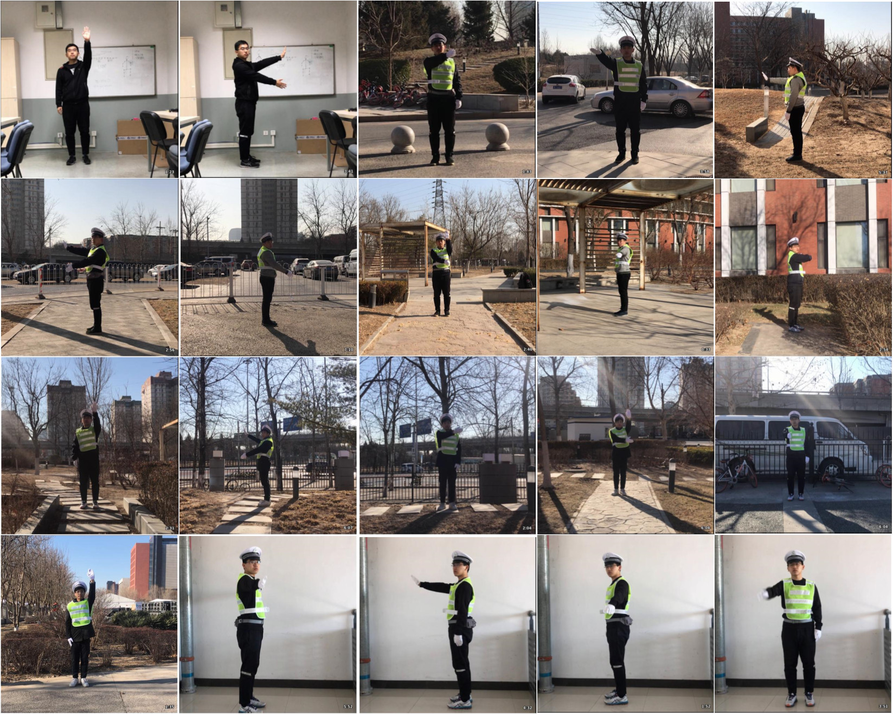
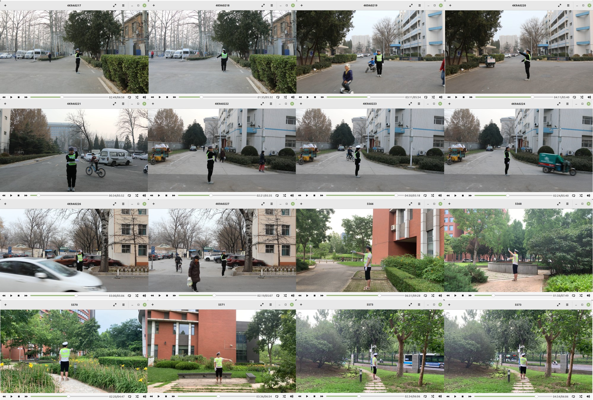
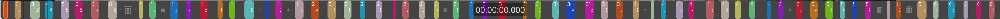
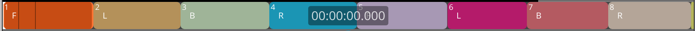
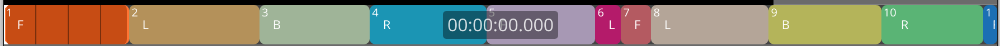

# Chinese Traffic Police Gesture Datasets
Summary of the Chinese traffic police gesture datasets published in our papers

## Chinese Traffic Police Gesture Dataset (CTPGesture v1)

This dataset contains videos of traffic polices making 8 kinds of Chinese traffic commanding gestures.

### Preview

<p align="center">
    
</p>

### Download

[Google Drive](https://drive.google.com/file/d/1QT88DwKyhJ4-hEk81YEpGvikKDS_uqjj/view?usp=sharing)

### Files

```
.
├── test            # Testing set
│   ├── 002.csv     # *.csv: Gesture labels
│   ├── 002.mp4     # *.mp4: Videos
│   ├── 004.csv
│   ├── 004.mp4
│   ├── 008.csv
│   ├── 008.mp4
│   ...
└── train           # Training set
    ├── 001.csv
    ├── 001.mp4
    ├── 003.csv
    ├── 003.mp4
    ├── 005.csv
    ├── 005.mp4
    ...

```

- **.mp4 file**: RGB Video of continuous traffic police gestures. Frame-rate: constant, 15. Resolution: 1080x1080 
- **.csv file**: Per-frame annotated gesture labels.

### Annotation

The meaning of labels in .csv files.

| Label   | Meaning   | 
|--------------|-----------|
| 0 | No gesture / Stand in attention |
| 1 | Stop |
| 2 | Forward |
| 3 | Left Turn |
| 4 | Left Turn Waiting |
| 5 | Right Turn |
| 6 | Lane Changing |
| 7 | Slow Down |
| 8 | Pull Over |

## Direction Specified Chinese Traffic Police Gesture Dataset (CTPGesture v1)

This dataset contains 32 traffic police gestures composed of 8 commands and 4 commanding directions.

### Preview

#### Videos:

<p align="center">
    
</p>

#### Gesture labels:
<p align="center">
    
</p>
<p align="center">
    
</p>

#### Orientation labels:

<p align="center">
    
</p>
<p align="center">
    
</p>

### Download
[Google Drive](https://drive.google.com/file/d/1ItPsIYY828LPkoal1y9TEfrg-_IDchj3/view?usp=sharing)

### Files

```
.

(RGB videos and Manually Annotated Labels)

├── video                       # Police gesture videos
│   ├── 4K9A0217.m4v
│   ├── 4K9A0218.m4v
│   ...
├── label_gesture_timestamp     # 9 Gesture labels
│   ├── 4K9A0217-proj.llc
│   ├── 4K9A0218-proj.llc
│   ...
├── label_orientation_timestamp # 4 body orientations
│   ├── 4K9A0217-proj.llc
│   ├── 4K9A0218-proj.llc
│   ...

(Pseudo Labels)

├── label_gesture_frame         # per-frame gesture labels
│   ├── 4K9A0217.json5          
│   ├── 4K9A0218.json5
│   ...
├── label_orientation_frame     # per-frame orientations
│   ├── 4K9A0217.json5
│   ├── 4K9A0218.json5
│   ...
├── label_combine_frame         # per-frame labels, totally 4(orientations)*8(commands)+1(inactive) = 33 gestures
│   ├── 4K9A0217.json5
│   ├── 4K9A0218.json5
│   ...
├── track_mul                   # Trace of people
│   ├── 4K9A0217.pkl
│   ├── 4K9A0218.pkl
│   ...
├── track_single                # Trace of the police
│   ├── 4K9A0217.pkl
│   ├── 4K9A0218.pkl
│   ...
├── vibe                        # SMPL parameters estimated with VIBE
│   ├── 4K9A0217.pkl
│   ├── 4K9A0218.pkl
│   ...
```

### Annotation

#### The meaning of **gesture labels**:

| Label   | Meaning   | 
|--------------|-----------|
| 0 | No gesture / Stand in attention |
| 1 | Stop |
| 2 | Forward |
| 3 | Left Turn |
| 4 | Left Turn Waiting |
| 5 | Right Turn |
| 6 | Lane Changing |
| 7 | Slow Down |
| 8 | Pull Over |

#### The meaning of **orientation labels**:

| Label   | Meaning   | 
|--------------|-----------|
| F | The police face the camera |
| L | The police's left side face the camera |
| B | The police back to the camera |
| R | The police's right side face the camera |